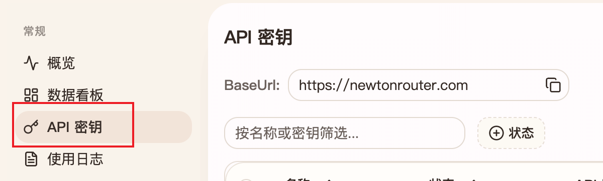
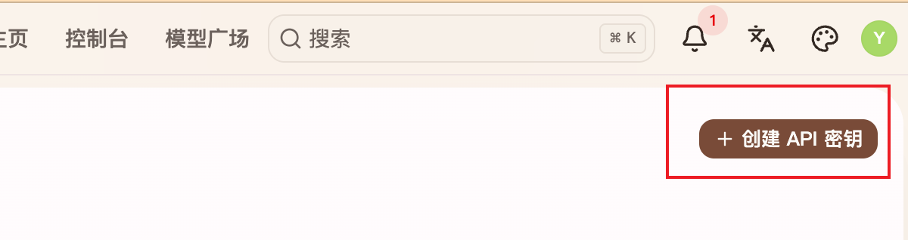
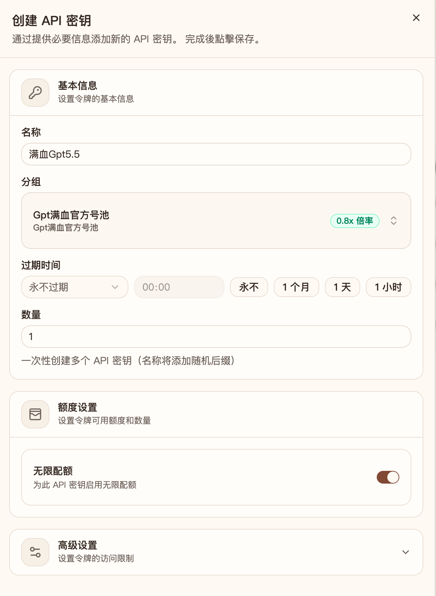

# 快速开始

使用牛顿 AI 中转站前，先完成账号注册、充值订阅和 API 密钥创建。

## 注册账号

1. 访问 [牛顿 AI 中转站](https://newtonrouter.com/)。
2. 使用邮箱接收验证码并完成注册。

## 充值和订阅

1. 进入 **控制台**。
2. 点击左侧 **钱包**。
3. 输入任意金额充值，或选择订阅套餐。

!!! tip "试用套餐"
    现在有 0.01 元购买 2 元额度的试用套餐，每人限购 1 份。

## 创建密钥

1. 进入 **控制台**。
2. 点击左侧 **API 密钥**。

3. 点击右上角 **创建密钥**。

4. 填入密钥名称。
5. 选择要使用的分组。
6. 配置额度后保存。

